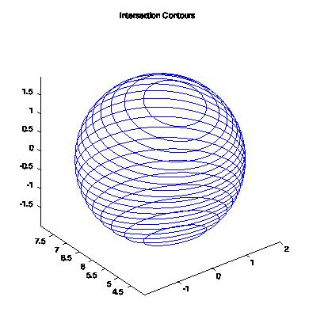
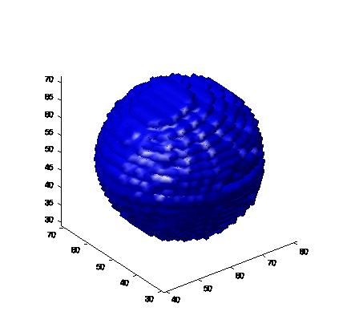

# 2Dto3D-Reconstruction

## Instructions

1. To create the virtual phantom, "run create_virtual_function.m". It would generate a spherical virtual phantom (given below) and save the 2D slices of it in separate folder called "Projection_Images".

2. To reconstruct the 3D volume using the slices, run the "reconstruct.m". It would generate the reconstruted image and save it in the "Projection_Images" folder.

